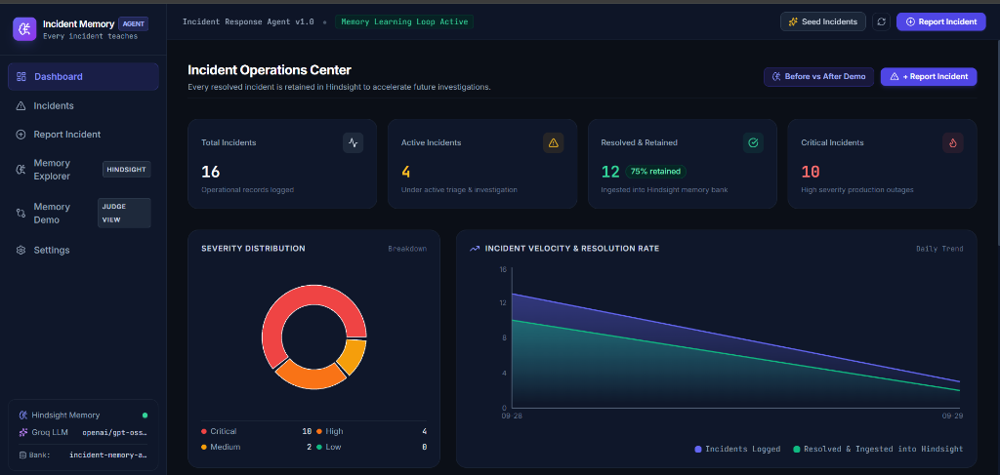
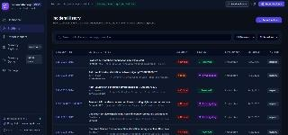
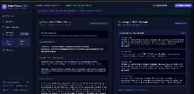
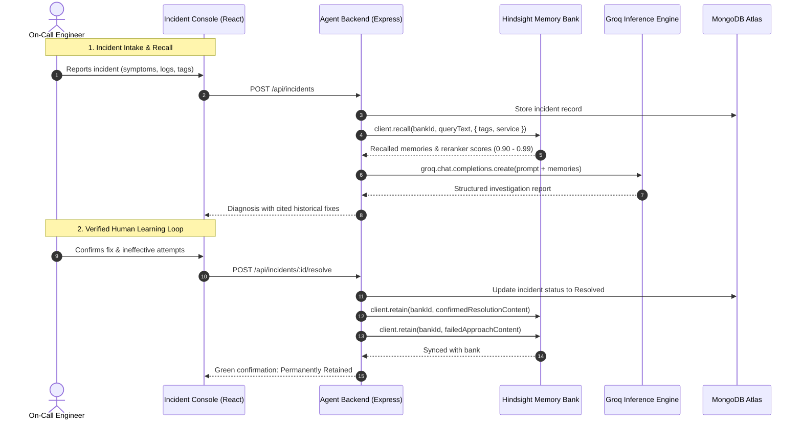
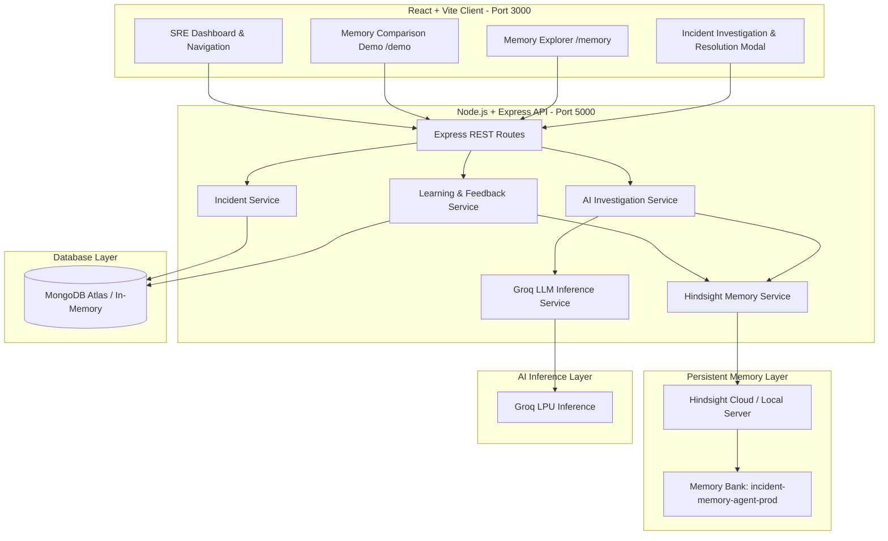

# Incident Memory Agent

> **"Every incident teaches the next one."**

An autonomous AI incident response platform that uses **Hindsight persistent memory** (by Vectorize) and **Groq high-speed LLM inference** to remember verified production incident resolutions, eliminate repetitive triage, and slash Mean Time to Resolution (MTTR).

---

## 📺 Demo Video & Interface Walkthrough

[](https://drive.google.com/file/d/1HxSjzUgjz84n2xTiP3ep_DfL-935Zech/view?usp=sharing)

> **🎥 Watch the Full Demonstration Video on Google Drive:**  
> **[Incident Memory Agent Walkthrough Video](https://drive.google.com/file/d/1HxSjzUgjz84n2xTiP3ep_DfL-935Zech/view?usp=sharing)**

### 1. Incident Operations Center Dashboard
*Real-time incident metrics, severity distribution, resolution rate charts, and live Hindsight persistent memory feed.*


### 2. Incident History & Operational Triage
*Operational incident records, multi-parameter search, and status tracking.*


### 3. Memory Value Demonstration: Before & After Hindsight
*Controlled side-by-side comparison proving how Hindsight persistent memory eliminates redundant trial-and-error diagnostics.*


---

## 💥 Problem Statement & Solution

### The Problem
When production incidents strike, on-call engineers spend precious minutes—often hours—rediscovering failure modes that someone else on the team already diagnosed months earlier. 
- **Institutional Amnesia**: Knowledge remains siloed in forgotten Slack channels, Jira tickets, or disconnected Google Docs.
- **Stateless LLMs**: Generic AI assistants lack persistent organizational context across sessions and hallucinate generic troubleshooting steps without knowing what worked in your specific environment.
- **Repeated Mistakes**: Teams repeatedly attempt ineffective fixes (such as blind pod restarts) that previously worsened outages.

### The Solution
**Incident Memory Agent** introduces a closed-loop persistent memory architecture:
1. **Intelligent Recall**: When an incident occurs, the agent queries Hindsight to retrieve verified past resolutions matching the microservice, symptoms, and error signatures.
2. **Context-Grounded Triage**: Groq generates a structured investigation report citing real past incident IDs and warning against previously failed approaches.
3. **Continuous Learning**: Once an engineer verifies the fix, the root cause, remediation steps, and negative examples are ingested into Hindsight to permanently educate the agent for future incidents.

---

## 🏆 Hackathon Alignment & Highlights

- **Innovation (30%)**: Transitions incident triage from stateless one-off chat interactions into an autonomous, closed-loop organizational memory system.
- **Deep Hindsight Integration (25%)**: Employs the official `@vectorize-io/hindsight-client` across all core capabilities: **Retain** (ingesting confirmed fixes & anti-patterns), **Recall** (hybrid semantic & entity search), and **Reflect** (cross-incident belief synthesis).
- **Technical Excellence (20%)**: Enterprise-grade TypeScript stack with Express, MongoDB/Mongoose, React 18, Vite, Tailwind CSS, Zod schema validation, untrusted telemetry isolation, and automated tests.
- **Rich User Experience (15%)**: High-contrast dark-mode SaaS UI, interactive analytics charts (Recharts), live memory query inspector, and a side-by-side memory value comparison page.
- **Real-World Impact (10%)**: Directly targets MTTR by turning past engineering postmortems into immediate, sub-second remediation guidance.

---

## 🧠 How Hindsight is Used

The agent integrates `@vectorize-io/hindsight-client` into the operational incident lifecycle:



### 1. Retain (Knowledge Ingestion)
When an incident is resolved, `hindsightService.retainKnowledge()` writes confirmed knowledge to the memory bank:
- **Verified Resolutions**: The confirmed root cause, exact remediation steps, and lessons learned.
- **Failed Approaches (Anti-patterns)**: Preserves what did *not* work (e.g. *"Restarting pods without resizing pool limits was futile"*), ensuring future engineers don't repeat mistakes.
- **Structured Metadata**: Attaches service names, severity, environment, and tags for precision filtering.

### 2. Recall (Sub-Second Memory Retrieval)
During triage, `hindsightService.recallMemories()` queries Hindsight using multi-strategy retrieval:
- **Dense Vector Search**: Matches contextual semantics between error logs and past symptoms.
- **Sparse BM25 & Keyword Search**: Indexes technical terms like `HikariPool-1`, `ECONNRESET`, or `OOMKilled`.
- **Entity Graph**: Automatically associates incidents with microservices, error classes, and infrastructure components.
- **Native Reranking**: Utilizes Hindsight reranker scores (`scores.reranker`) to surface only the most relevant historical incidents.

### 3. Reflect (Cross-Incident Synthesis)
Via `hindsightService.reflectOverMemories()`, engineers can prompt the reflection engine to synthesize high-level patterns across the bank (e.g., *"What are recurring database failure patterns across payment services?"*).

---

## 🚀 Key Features

| Feature | Description |
|---------|-------------|
| **Operations Dashboard** | Real-time metric cards, severity breakdown donut chart, 7-day velocity area chart, recent incidents feed, and live memory activity stream. |
| **Instant Incident Intake** | Quick-preset scenario buttons (*Connection Pool*, *Redis Flap*, *Webhook Reset*) and customizable intake with automatic AI investigation. |
| **AI Investigation Reports** | Structured reports with executive summaries, verified past incident citations, suggested resolution plans, and safety considerations. |
| **Human-in-the-Loop Resolution** | Explicitly separates unconfirmed AI hypotheses from verified engineer fixes. Submitting a resolution feeds the persistent learning loop. |
| **Before & After Demo (`/demo`)** | Side-by-side controlled comparison on identical symptoms demonstrating how persistent memory eliminates trial-and-error diagnostics. |
| **Memory Explorer (`/memory`)** | Live interactive recall query tester, reflection engine console, and memory bank activity audit table. |
| **Enterprise Guardrails** | Untrusted diagnostic input isolation, strict Zod schema validation, and zero client-side credential exposure. |

---

## 🛠️ Tech Stack

- **Frontend**: React 18, Vite, TypeScript, Tailwind CSS, Lucide Icons, Recharts
- **Backend**: Node.js, Express, TypeScript, Zod, Tsx
- **Persistent Memory**: `@vectorize-io/hindsight-client` (Vectorize.io Cloud / Self-hosted)
- **AI Inference Engine**: Groq SDK (`llama-3.3-70b-versatile`, `openai/gpt-oss-120b`, `qwen/qwen3-32b`)
- **Operational Database**: MongoDB & Mongoose (MongoDB Atlas + automatic in-memory fallback)
- **Testing**: Vitest, Supertest

---

## 📐 System Architecture



---

## 📦 Directory Structure

```text
incident-memory-agent/
├── client/                     # Frontend React + Vite application
│   ├── src/
│   │   ├── api/client.ts       # Typed API client connecting to backend
│   │   ├── components/         # UI components (Sidebar, Navbar, Badges, Modals, Reports)
│   │   ├── pages/              # Dashboard, Incidents, Detail, Memory Explorer, Demo, Settings
│   │   ├── types/              # Shared TypeScript interfaces
│   │   ├── App.tsx             # Root application and routing
│   │   └── main.tsx
│   ├── index.html
│   ├── tailwind.config.js
│   ├── vite.config.ts
│   └── package.json
│
├── server/                     # Backend Express + TypeScript application
│   ├── src/
│   │   ├── config/             # Database, Hindsight, and Groq configuration
│   │   ├── controllers/        # Incident, Investigation, Memory, Demo controllers
│   │   ├── middleware/         # Centralized error handling, Zod validation
│   │   ├── models/             # Mongoose schemas: Incident, Investigation, MemoryEntry
│   │   ├── routes/             # REST API endpoint definitions
│   │   ├── services/           # Hindsight, LLM, Incident, Investigation, Learning services
│   │   ├── tests/              # Vitest test suites
│   │   ├── utils/              # Structured logger, prompts, seed dataset
│   │   ├── app.ts              # Express application setup
│   │   └── server.ts           # Server bootstrap and graceful shutdown
│   ├── tsconfig.json
│   └── package.json
│
├── docs/                       # Project documentation assets
│   └── images/                 # Dashboard & comparison screenshots
├── .env.example                # Documented environment variable templates
└── package.json                # Root scripts for monorepo management
```

---

## ⚡ Quick Start & Run Instructions

### Prerequisites
- **Node.js** >= 18 (Tested on v20 & v22)
- **npm** >= 9

### 1. Clone the Repository
```bash
git clone https://github.com/Nadirsha-Syed/Incident-memory-agent.git
cd Incident-memory-agent
```

### 2. Configure Environment Variables
Create your environment file by copying `.env.example`:

```bash
cp .env.example server/.env
```

Open `server/.env` and supply your credentials:

```env
PORT=5000
CLIENT_URL=http://localhost:3000

# MongoDB Connection String (Leave blank for automatic In-Memory MongoDB)
MONGODB_URI=your_mongodb_atlas_connection_string

# Groq API Configuration (https://console.groq.com/keys)
GROQ_API_KEY=your_groq_api_key
GROQ_MODEL=llama-3.3-70b-versatile

# Hindsight Persistent Memory (Vectorize.io)
HINDSIGHT_API_URL=https://api.hindsight.vectorize.io
HINDSIGHT_API_KEY=your_hindsight_api_key
HINDSIGHT_BANK_ID=incident-memory-agent-prod
```

> **Zero-Config Fallback Mode:**
> If `MONGODB_URI`, `GROQ_API_KEY`, or `HINDSIGHT_API_KEY` are omitted, the application automatically enables resilient local fallbacks (in-memory MongoDB instance, local semantic indexing, and deterministic SRE inference) so reviewers can test the application immediately with zero setup friction.

### 3. Install Dependencies
Install dependencies across both client and server:
```bash
npm install
npm --prefix server install
npm --prefix client install
```

### 4. Run the Development Servers
From the root directory, start both the backend API and frontend client:

```bash
# Terminal 1: Start Backend API (Port 5000)
npm run dev:server

# Terminal 2: Start Frontend Client (Port 3000)
npm run dev:client
```

Open your browser at **`http://localhost:3000`**.

---

## 🔑 Required Environment Variables

| Variable | Required? | Default / Example | Purpose |
|----------|-----------|-------------------|---------|
| `PORT` | Optional | `5000` | Backend API port |
| `CLIENT_URL` | Optional | `http://localhost:3000` | Frontend client origin for CORS policy |
| `MONGODB_URI` | Optional | `mongodb+srv://...` | MongoDB connection string (falls back to in-memory MongoDB) |
| `GROQ_API_KEY` | Recommended | `your_groq_api_key` | Groq inference API key for live LLM diagnosis |
| `GROQ_MODEL` | Optional | `llama-3.3-70b-versatile` | Model identifier (`llama-3.3-70b-versatile`, `openai/gpt-oss-120b`) |
| `HINDSIGHT_API_URL`| Optional | `https://api.hindsight.vectorize.io` | Hindsight service endpoint |
| `HINDSIGHT_API_KEY`| Recommended | `your_hindsight_api_key` | Vectorize Hindsight API authentication token |
| `HINDSIGHT_BANK_ID`| Optional | `incident-memory-agent-prod` | Target persistent memory bank partition |

---

## 🔒 Security & Safe Operation

- **Zero Credential Exposure**: API keys and database strings are handled strictly in the Node.js runtime and are never sent to or visible in client-side bundles.
- **Untrusted Diagnostic Input Isolation**: Error traces and logs are sanitized and isolated in system prompts to defend against prompt injection vectors.
- **Zod Schema Validation**: All incoming requests to `/api/incidents`, `/api/incidents/:id/resolve`, and `/api/memory/reflect` undergo rigorous schema validation.
- **Human Confirmation Safeguards**: The AI agent marks all suggested production actions as requiring engineer confirmation to prevent automated unintended modifications.

---

## 📜 License

MIT License. Built for the Vectorize Hindsight Hackathon.
